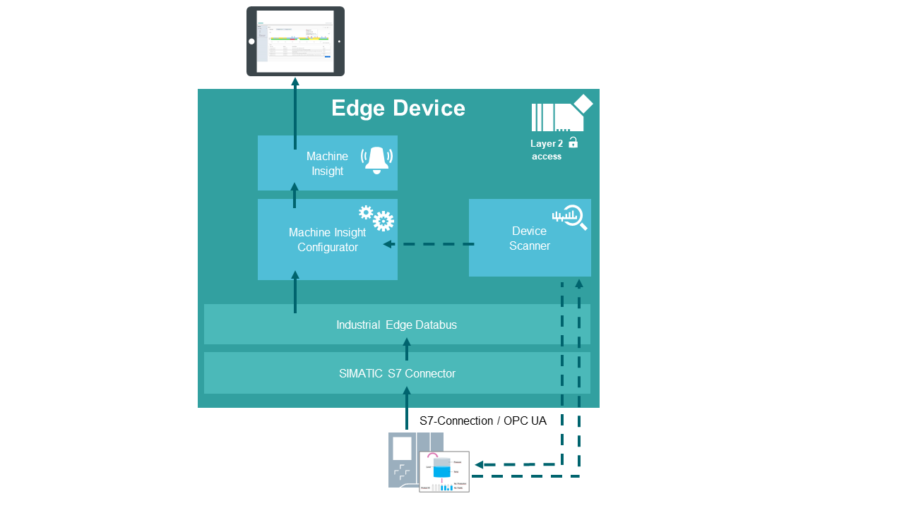

# Machine Insight application example

This example shows how to use the Industrial Edge App “Machine Insight” 

- [Machine Insight application example](#machine-insight-application-example)
  - [Description](#description)
    - [Overview](#overview)
    - [General task](#general-task)
  - [Requirements](#requirements)
    - [Prerequisities](#prerequisities)
    - [Used components](#used-components)
    - [TIA Project](#tia-project)
  - [Configuration steps](#configuration-steps)
  - [Usage](#usage)
  - [Documentation](#documentation)
  - [Contribution](#contribution)
  - [Licence and Legal Information](#licence-and-legal-information)

## Description

### Overview

This document describes how to display important PLC data such as alarms or device status in Machine Insight.

### General task

The example reads out the PLC status and displays it in Machine Insight. 
A status mapping can also be created in the Machine Insight Configurator with which the machine status can be read out and displayed. 
The data is published on the Databus via the S7 Connector, where the Machine Insight Configurator can retrieve the required data. 
First, the S7 Configurator and the Databus must be configured. Then select the correct PLC and the data bus in the Machine Insight Configurator. 
The required machine status is created in the status mapping. 
In Machine Insight you can see all alarms, error messages and the self-created machine status of the PLC. 

## Requirements

###  Prerequisities

- Access to an Industrial Edge Management System (IEM)
- Onboarded Industial Edge Device on IEM
- Installed System Configurators for Databus and S7 Connector
- Installed System Apps Databus and S7 Connector
- Installed Apps Device Scanner, Machine Insight Configurator and Machine Insight
- Edge device is connected to PLC
- TIA portal project loaded on PLC (e.g. for filling application)
- Google Chrome (Version ≥ 72) or Firefox (Version ≥ 62)

### Used components

- Industrial Edge Management (IEM) V1.2.0-34
- S7 Connector Configurator V1.2.32
- S7 Connector V1.2.26
- IE Databus Configurator V1.2.23
- IE Databus V1.2.16
- Device Scanner 1.1.1
- Machine Insight Conifgurator 1.2.01
- Machine Insight 1.2.01
- Industrial Edge Device V 1.2.0-56
- TIA Portal V16
- S7-1511
- Web browser (Mozilla or Chrome)

### TIA Project

The used TIA Portal project can be found in the [miscellenous repository](https://github.com/industrial-edge/miscellaneous/tree/main/tank%20application) under the following name and is also used for several further application examples:

- [tia-tank-application.7z](https://github.com/industrial-edge/miscellaneous/blob/main/tank%20application/tia-tank-application.7z)

## Configuration steps

You can find the further information about the following steps in the [docs](docs/Installation.md)
- Configure PLC Connection (Databus, S7 Connector)
- Configure Machine Insight Configurator and Machine Inisght

## Usage

Once the Machine Insight Configurator App is configured, alarms, diagnostic buffers and device status can be read from the PLC. 
Now the data can be displayed and read in Machin Insight.

## Documentation

You can find further documentation and help in the following links
  - [Industrial Edge Hub](https://iehub.eu1.edge.siemens.cloud/#/documentation)
  - [Industrial Edge Forum](https://www.siemens.com/industrial-edge-forum)
  - [Industrial Edge landing page](https://new.siemens.com/global/en/products/automation/topic-areas/industrial-edge/simatic-edge.html)
  
## Contribution

Thanks for your interest in contributing. Anybody is free to report bugs, unclear documenation, and other problems regarding this repository in the Issues section or, even better, is free to propose any changes to this repository using Merge Requests.

## Licence and Legal Information

Please read the [Legal information](LICENSE.md).
