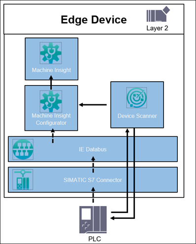

# Machine Insight application example

This guide shows how to use the Industrial Edge application Machine Insight.

- [Machine Insight application example](#machine-insight-application-example)
  - [Description](#description)
    - [Overview](#overview)
    - [General task](#general-task)
  - [Requirements](#requirements)
    - [Prerequisities](#prerequisities)
    - [Used components](#used-components)
    - [TIA Project](#tia-project)
  - [Configuration steps](#configuration-steps)
  - [Usage](#usage)
  - [Documentation](#documentation)
  - [Contribution](#contribution)
  - [Licence and Legal Information](#license-and-legal-information)
  

## Description

### Overview

The application Machine Insight is a condition monitoring application which enables easy and efficient remote diagnosis of the machines. It provides global comprehensive view of assembly lines and machines, and provides transparency about your machine with worldwide access to machine conditions and events to improve your service processes.

The Machine Insight application enables you to gather different types of diagnostic information: machine status (status mapping), device status (PLC), device alarms and device updates. The data is visualized within an intuitive user interface with Gantt chart, notification icons and logbooks for device alarms and device updates.

This repository describes how to setup the environment for using the Machine Insight app. The goal is to display all the important device data for the connected PLC.

### General task

For the remote diagnostic of a PLC via Machine Insight, it is required that the PLC and the IED are connected to the same network.
Machine Insight collects the device data from the PLC via the SIMATIC S7+ Connector. This connector must be configured via the Common Configurator app. For retrieving the PLC alarms you need to create an asset structure and a dedicated alarm channel within the IIH Essentials app. Since Machine Insight is based on this asset structure, you can configure one PLC dashboard for each asset. For visualizing the machine status it is necessary to configure a status mapping within Machine Insight and assign the dedicated PLC parameter to the asset. Finally you can configure one or more assets to show the dedicated device and machine data:
- Machine status (via PLC variable and status mapping)
- Device status (PLC status)
- Device alarms (system/process/security alarms)
- Device updates (PLC changes, e.g. SW program update)

**Important to know:**
- V2.0 only supports S7-1500 PLCs
- Max. 8 connected PLCs per app possible
- SIMATIC S7+ Connector >= V1.4 necessary

## Requirements

###  Prerequisities

- Access to an Industrial Edge Management (IEM) with onboarded Industrial Edge Device (IED)
- Installed system configurators and apps (see list "Used components")
- Installed apps (see list "Used components")
- IED is connected to PLC
- TIA portal project loaded on PLC
- Export of TIA portal project via SIMATIC SCADA Export available (.zip)
- Google Chrome (Version ≥ 72)

### Used components

- Industrial Edge Management (IEM) V 1.5.5-2 / V 1.16.11
  - Databus Configurator V 3.0.0
  - Common Connector Configurator V 1.10.1-2
- Industrial Edge Device (IED) simatic-ipc-ied-os-2.1.0-22
  - Databus V 3.0.0
  - SIMATIC S7+ Connector V 1.4.0
  - IIH Essentials V1.11.0
  - Common Configurator V 1.11.1
  - Registry Service V 1.11.0
  - Common Import Converter V 2.2.0
  - Machine Insight V 2.0.0
- PLC: CPU 1515F-2
- TIA Portal V16
- SIMATIC SCADA Export (V16) V2.0

### TIA Project

The used TIA Portal project can be found in the [miscellenous repository](https://github.com/industrial-edge/miscellaneous/tree/main/tank%20application) and is also used for several further application examples.

## Configuration steps

You can find further information about the following steps in the [Configuration](docs/Installation.md) documentation:
- Configuration of Databus
- Configuration of SIMATIC S7+ Connector via Common Configurator
- Configuration of IIH Essentials
- Configuration of Machine Insight

## Usage

Once the setup is done, you can open the UI of the Machine Insight application.
Navigate to the asset which was configured to see the overview dashboard.

The Gantt chart displays the following data:

- Machine status based on configured status mapping
- Current device status of PLC
- Notification icons (alarm data, user program change, hardware configuration change, firmware update, textlist change, fail-safe program change etc.)

> Hint: The Gantt chart updates each 15 seconds.

The Gantt chart allows you to zoom in and view e.g. the machine status in detail.

By clicking on 'Legend' within the Gantt chart, you can see all current states.

## Documentation
- You can find further documentation and help in the following links
  - [Industrial Edge Hub]( https://iehub.eu1.edge.siemens.cloud/#/documentation)
  - [Industrial Edge Forum]( https://forum.mendix.com/link/space/industrial-edge)
  - [Industrial Edge landing page]( https://new.siemens.com/global/en/products/automation/topic-areas/industrial-edge/simatic-edge.html)
  - [Industrial Edge GitHub page]( https://github.com/industrial-edge)
  - [Industrial Edge documentation page]( https://docs.eu1.edge.siemens.cloud/index.html)
 
## Contribution
 
Thank you for your interest in contributing. Anybody is free to report bugs, unclear documentation, and other problems regarding this repository in the Issues section.
Additionally everybody is free to propose any changes to this repository using Pull Requests.
 
If you haven't previously signed the [Siemens Contributor License Agreement](https://cla-assistant.io/industrial-edge/) (CLA), the system will automatically prompt you to do so when you submit your Pull Request. This can be conveniently done through the CLA Assistant's online platform. Once the CLA is signed, your Pull Request will automatically be cleared and made ready for merging if all other test stages succeed.
 
## License and Legal Information
 
Please read the [Legal information](LICENSE.md).
