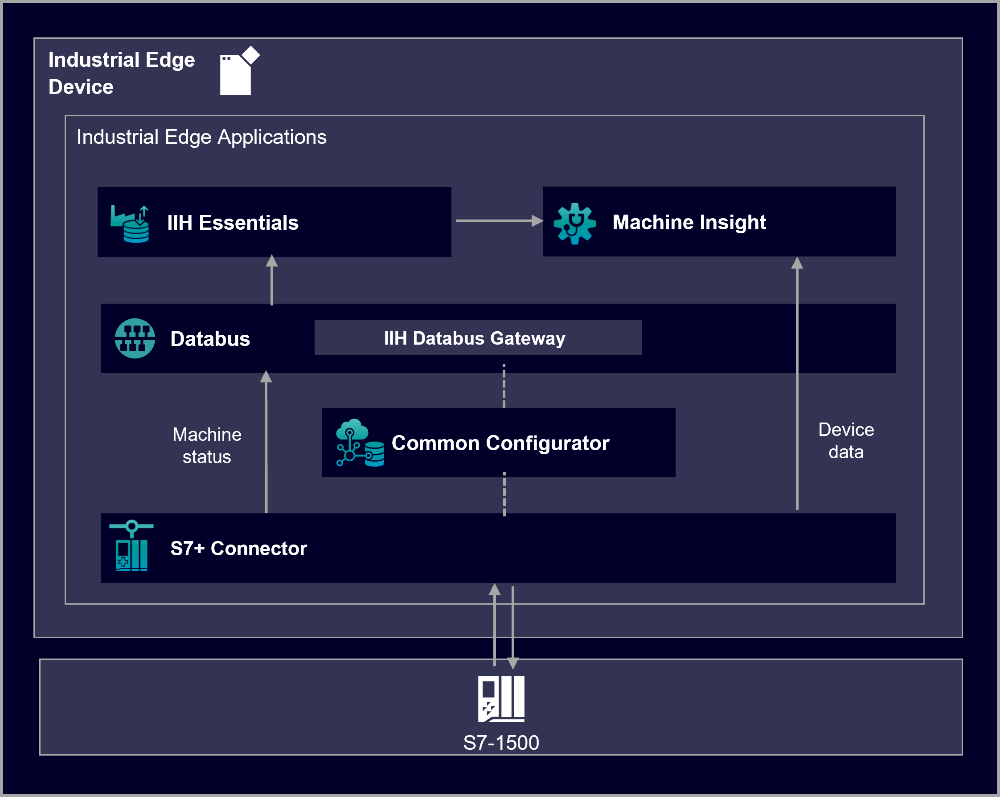

# Machine Insight application example

This guide shows how to use the Industrial Edge application Machine Insight.

- [Machine Insight application example](#machine-insight-application-example)
  - [Description](#description)
    - [Overview](#overview)
    - [General task](#general-task)
  - [Requirements](#requirements)
    - [Prerequisities](#prerequisities)
    - [Used components](#used-components)
    - [TIA Project](#tia-project)
  - [Configuration steps](#configuration-steps)
  - [Usage](#usage)
  - [Documentation](#documentation)
  - [Contribution](#contribution)
  - [Licence and Legal Information](#licence-and-legal-information)

## Description

### Overview

The application Machine Insight is a condition monitoring application which enables easy and efficient remote diagnosis of the machines. It provides global comprehensive view of assembly lines and machines and provides transparency about your machine to improve your service processes.

The Machine Insight application enables you to extract the data from the different sources. The data may be of different types: device status data, machine status data, alarms, diagnostic buffer data, and program changes or firmware updates on PLC.

This repository describes how to display important PLC data such as alarms or device status in Machine Insight.

### General task

The guide shows how to use the Machine Insight Configurator for configuring the data exchange with a PLC. Data collection can be configured either for alarms or for diagnostic buffer. Furthermore a status mapping is created to collect machine status data. The data comes in via the S7 Connector and then published on the Databus, where the Machine Insight Configurator can retrieve the required data.

Using Machine Insight the PLC data can be visualized and analyzed via a Gantt chart. Here you can see differnet PLC data, e.g. diagnostic buffer data, alarms, device status or firmware updates.

## Requirements

###  Prerequisities

- Access to an Industrial Edge Management (IEM) with onboarded Industrial Edge Device (IED)
- Installed system configurators and apps (see list "Used components")
- Installed apps (see list "Used components")
- IED is connected to PLC
- TIA portal project loaded on PLC
- Google Chrome (Version ≥ 72)

### Used components

- Industrial Edge Management (IEM) V1.4.0-42 / V1.4.11
  - IE Databus Configurator V 1.5.5
  - S7 Connector Configurator V 1.5.0-17
- Industrial Edge Device (IED) V 1.2.0-56
  - IE Databus V 1.5.3
  - S7 Connector V 1.5.0-25
  - Device Scanner Service V 1.0.2
  - Machine Insight Conifgurator V 1.3.1
  - Machine Insight V 1.3.1
- Industrial Edge App Publisher V1.4.3
- Docker Engine V20.10.10
- Docker Compose V1.28.5
- TIA Portal V16
- PLC: CPU 1515F-2

The **Device Scanner Service** is optional but required for using the scan functionality in Machine Insight Configurator.

The **S7 Connector** and the **IE Databus** are optional but required for using the machine status feature in Machine Insight Configurator.

### TIA Project

The used TIA Portal project can be found in the [miscellenous repository](https://github.com/industrial-edge/miscellaneous/tree/main/tank%20application) and is also used for several further application examples.

## Configuration steps

You can find the further information about the following steps in the [docs](docs/Installation.md)
- Configuration for Device Scanner Service
- Configure PLC Connection (Databus, S7 Connector)
- Configure Machine Insight

## Usage

Once the set up is done with the Machine Insight Configurator, we can open the UI of the Machine Insight application.

Select your device in the menu on the left side. In the overview tab you can see a Gantt chart and logbook records. The Gantt chart displays the following data:

- Machine Status based on configured status mapping
- Device Status of PLC ...
- Notification Icons ...

?? Here the PLC data is displayed. We can see alarms, diagnostic buffers and device status can be read from the PLC. 
?? Here you can see the device status, notification icon and mapping status.

## Documentation

You can find further documentation and help in the following links
  - [Industrial Edge Hub](https://iehub.eu1.edge.siemens.cloud/#/documentation)
  - [Industrial Edge Forum](https://www.siemens.com/industrial-edge-forum)
  - [Industrial Edge landing page](https://new.siemens.com/global/en/products/automation/topic-areas/industrial-edge/simatic-edge.html)
  
## Contribution

Thanks for your interest in contributing. Anybody is free to report bugs, unclear documenation, and other problems regarding this repository in the Issues section or, even better, is free to propose any changes to this repository using Merge Requests.

## Licence and Legal Information

Please read the [Legal information](LICENSE.md).
